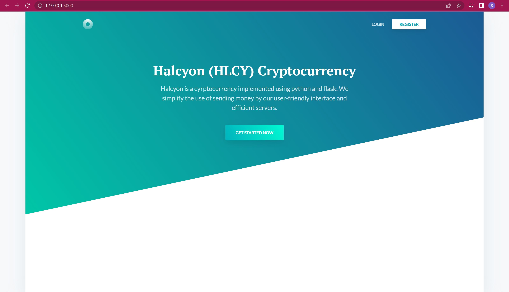
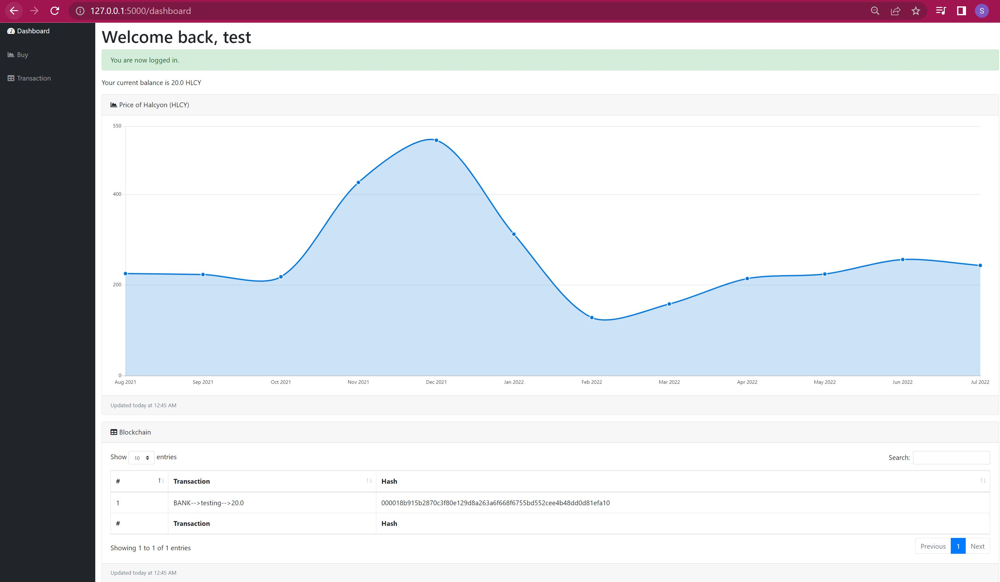

# Halcyon Coin 
Halcyon Coin is a cryptocurrency transacted upon a blockchain that was implemented from scratch using Python. 

I used Python for the backend, which is connected to an SQL database, and Flask to create a frontend interface in which users can create an account, purchase Halcyon Coin, sell Halcyon Coin, and see Halcyon Coin transactions on the dashboard. 

## Features
This web application is accompanied with user verification and blockchain validation. Explanation about the details of my code can be found as comments inside the Python files in this repository. 

## Inspiration 
I wanted to learn about blockchain technology and practice fullstack web development using Python. I feel this beginner project helped me get started on the skills I wanted to learn quite nicely. 

## Installation 
If you would like to clone this repository locally,

1) Git clone https://github.com/alnmathw/halcyon-coin.git
2) Create a Python virtual environment and pip install the project dependencies 
3) Ensure that your SQL database server is running 
4) Run the code from app.py

Success!
